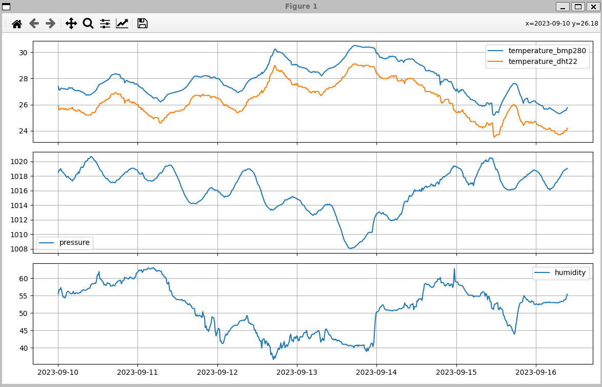

# Real Weather Station - Observer Pattern
This repository contains a real weather station implemented on a Raspberry Pi as a mean to study the Observer Design Pattern.

The Raspberry is equipped with a BMP280 sensor that provides current temperature and absolute atmospheric pressure, available through its own driver as an IIO Device. There is also a DHT22 that provides humidity and temperature. This information is read by the Weather Station and made available for all observers.

There's a .service file that can be installed. This service runs a Python script in the background that triggers an updates of the station every 15 minutes. The data is stored in a SQLite database. 

The Python scripts access the Weather Station capabilities using a wrapper.

The Observer Pattern was implemented using the examples from the book Head First Design Patterns, 2nd Edition, Chapter 2.

## Running Locally

After cloning on the Raspberry Pi, compile the shared library with the build script.
```bash
$ ./build.sh
```

Test if the sensor is working by running a sample program. It should create a Weather Station instance, register two observers and notify them with current temperature and pressure.

The data structure is, in this order: BMP280 temperature in C, DHT22 temperatuere in C, relative atmospheric pressure and humidity.

```bash
$ ./build/main
Weather Station initialized. Altitude: 685 m
Registering new observer: 0x11a0f20
Registering new observer: 0x11a0f68
Bad temperature read from Sensor 0
Bad temperature read from Sensor 0
Notifying observers
Client 1: 27.480000, 25.700001, 1021.810303, 53.099998
Client 2: 27.480000, 25.700001, 1021.810303, 53.099998
Client 1: 27.480000, 25.700001, 1021.810303, 53.099998
27.480000, 25.700001, 1021.810303, 53.099998
```

# Enable the service
Add the file `weather-station/service/weather_station.service` to RaspberryPi's systemd.
This service will read all available station data and save to the database in 15 minute intervals.

# Plotting from database
Plotting from database can be simply executed by running the `weather-station/scripts/plot_history.py` script.
To plot from a specific date, just pass the database path and the desired dates:
- Plot everything from 10/09/2023 until now:

`$ python3 plot_history.py --db ~/weather-station/database/station.db --start 2023-09-10`


